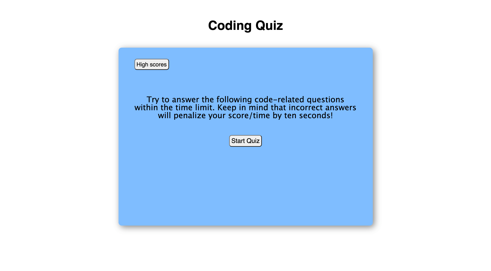

# Coding-Quiz

## Description

An easy to use multiple choice coding quiz is a fun way to test your general JavaScript coding knowledge. JavaScript is used to make the quiz come to life through user clicks and inputs. The quiz begins with a countdown timer once the "Start Quiz" button is clicked. The user is then presented with coding related questions that reward correct answers with 1 point or subtract 10 seconds of time for incorrect answers. The total time alotted is 60 seconds and the quiz ends when all questions have been answered or time reaches 0. After completing the Coding Quiz the user can submit their score with their initials to be stored and referenced by clicking the "High scores" button.

## Usage

1. Read the on-screen instructions and click "Start Quiz" to begin.
2. Answer each question to the best of your ability by clicking your choice.
3. Enter your initials and click submit to save your high score!
4. Click "Play Again" for another try!

## Mock-up

The following images show the web application's appearance and functionality:

.png)
.png)
.png)

[Deployed Application](https://djbalabis.github.io/Coding-Quiz/)